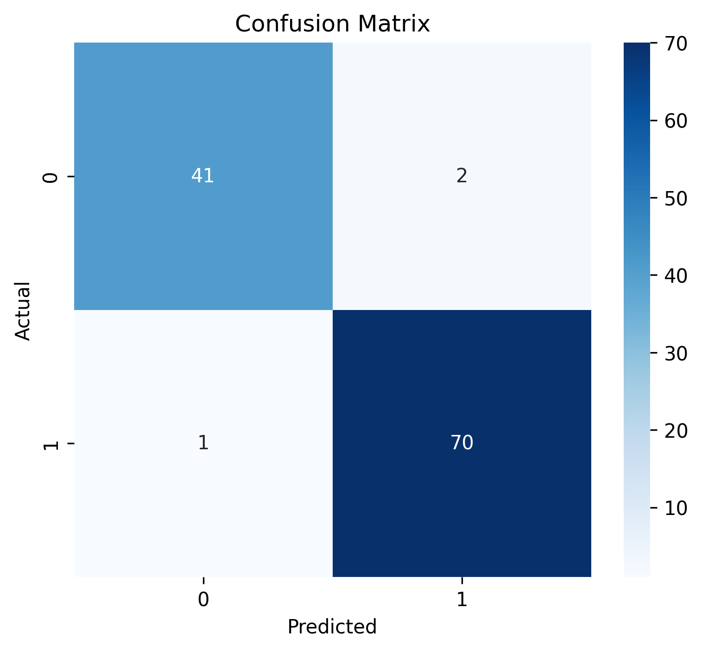
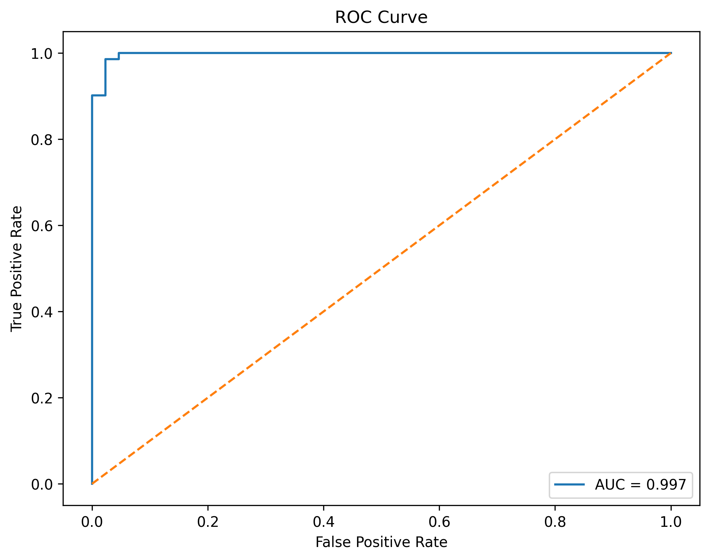
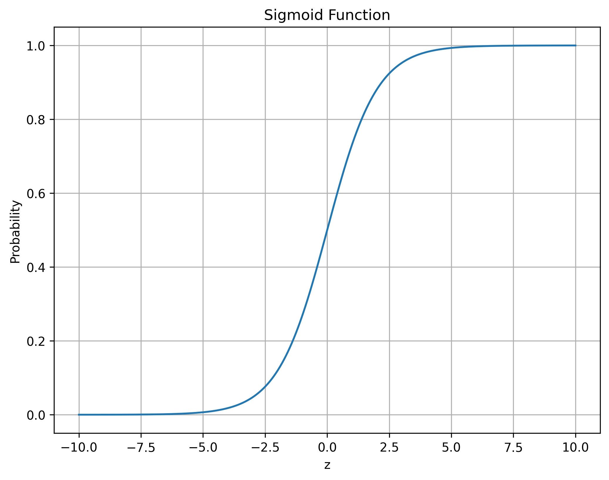

# ElevateLabs-Task4
# 🎯 Breast Cancer Classification using Logistic Regression


---

## 📌 Project Overview

This project implements **Logistic Regression**, a supervised machine learning algorithm used for **binary classification**.

The objective is to classify tumors as **Malignant** or **Benign** using the Breast Cancer Wisconsin Dataset. The project covers data preprocessing, model training, evaluation using classification metrics, ROC-AUC analysis, threshold tuning, and visualization of the sigmoid function.

---

## 🎯 Objectives

* Build a binary classification model using Logistic Regression
* Standardize numerical features
* Evaluate classification performance
* Understand confusion matrix, precision, recall, and ROC-AUC
* Visualize the sigmoid function
* Explore probability threshold tuning

---

## 🛠️ Tech Stack

| Tool         | Purpose                   |
| ------------ | ------------------------- |
| Python       | Programming Language      |
| Pandas       | Data Manipulation         |
| NumPy        | Numerical Computing       |
| Matplotlib   | Data Visualization        |
| Seaborn      | Statistical Visualization |
| Scikit-Learn | Machine Learning          |

---

## 📂 Dataset

### Breast Cancer Wisconsin Dataset

The dataset contains diagnostic measurements computed from digitized images of breast masses.

Target Classes:

| Class     | Value |
| --------- | ----- |
| Malignant | 0     |
| Benign    | 1     |

Features include:

* Radius
* Texture
* Perimeter
* Area
* Smoothness
* Compactness
* Concavity
* Symmetry
* Fractal Dimension

and several other diagnostic measurements.

---

## 🔍 Project Workflow

### 1️⃣ Data Loading

The Breast Cancer dataset was loaded using Scikit-Learn.

```python
from sklearn.datasets import load_breast_cancer

cancer = load_breast_cancer()

X = cancer.data
y = cancer.target
```

---

### 2️⃣ Train-Test Split

The dataset was divided into:

* 80% Training Data
* 20% Testing Data

```python
train_test_split(
    X,
    y,
    test_size=0.2,
    random_state=42
)
```

---

### 3️⃣ Feature Standardization

Since Logistic Regression performs better on standardized data, features were scaled using StandardScaler.

```python
from sklearn.preprocessing import StandardScaler
```

Benefits:

* Faster convergence
* Improved model stability
* Better performance

---

### 4️⃣ Model Training

A Logistic Regression classifier was trained using the standardized dataset.

```python
from sklearn.linear_model import LogisticRegression

model = LogisticRegression()

model.fit(
    X_train,
    y_train
)
```

---

### 5️⃣ Predictions

Predictions were generated on the test dataset.

```python
y_pred = model.predict(X_test)

y_prob = model.predict_proba(X_test)[:,1]
```

Where:

* `y_pred` = Predicted Class
* `y_prob` = Predicted Probability

---

## 📊 Model Evaluation

The model was evaluated using multiple classification metrics.

### Confusion Matrix

A confusion matrix summarizes prediction results.

|                 | Predicted Positive | Predicted Negative |
| --------------- | ------------------ | ------------------ |
| Actual Positive | TP                 | FN                 |
| Actual Negative | FP                 | TN                 |

Visualization:



---

### Precision

Measures prediction accuracy among positive predictions.

```text
Precision = TP / (TP + FP)
```

Interpretation:

> Of all samples predicted as positive, how many were actually positive?

---

### Recall

Measures the ability to identify positive cases.

```text
Recall = TP / (TP + FN)
```

Interpretation:

> Of all actual positive samples, how many were correctly identified?

---

### ROC-AUC Score

Measures the classifier's ability to distinguish between classes.

```text
AUC = 1.0  → Perfect
AUC = 0.9+ → Excellent
AUC = 0.8+ → Good
AUC = 0.5  → Random Guess
```

---

## 📈 ROC Curve

The ROC Curve illustrates the trade-off between:

* True Positive Rate (Recall)
* False Positive Rate



### Observation

A curve closer to the upper-left corner indicates stronger classification performance.

---

## 📉 Sigmoid Function

Logistic Regression converts linear outputs into probabilities using the Sigmoid Function:

```math
σ(z) = 1 / (1 + e^(-z))
```

Visualization:



### Interpretation

* Output ranges from 0 to 1
* Represents probability estimates
* Threshold determines final class prediction

---

## 🎚️ Threshold Tuning

Default Classification Threshold:

```text
0.5
```

Custom thresholds can be applied:

```python
y_pred_custom = (
    y_prob >= 0.3
).astype(int)
```

### Trade-Off

| Lower Threshold         | Higher Threshold      |
| ----------------------- | --------------------- |
| Higher Recall           | Higher Precision      |
| More Positives Detected | Fewer False Positives |

This demonstrates how business requirements can influence model decisions.

---

## 📁 Project Structure

```text
ElevateLabs-Task4/
│
├── data/
│   └── data.csv
│
├── images/
│   ├── confusion_matrix.png
│   ├── roc_curve.png
│   └── sigmoid_function.png
│
├── metrics.csv
│
├── logistic_regression.ipynb
│
└── README.md
```

---

## 🚀 Getting Started

### Clone Repository

```bash
git clone https://github.com/PushkarAgrawal17/ElevateLabs-Task4.git
```

### Navigate to Project

```bash
cd ElevateLabs-Task4
```

### Install Dependencies

```bash
pip install pandas numpy matplotlib seaborn scikit-learn
```

### Run Notebook

```bash
jupyter notebook
```

Open:

```text
logistic_regression.ipynb
```

---

## 🎓 Learning Outcomes

Through this project, I learned:

* Binary Classification
* Logistic Regression
* Feature Standardization
* Confusion Matrix Interpretation
* Precision and Recall Analysis
* ROC-AUC Evaluation
* Threshold Tuning
* Probability-Based Classification
* Sigmoid Function Fundamentals

---

## 🔮 Future Improvements

* Hyperparameter Tuning
* Cross Validation
* Feature Selection
* Compare with Decision Trees and Random Forests
* Deploy the model using Flask or FastAPI

---

## 👨‍💻 Author

**Pushkar Agrawal**

B.Tech CSE Student | Machine Learning Enthusiast | AI Learner

